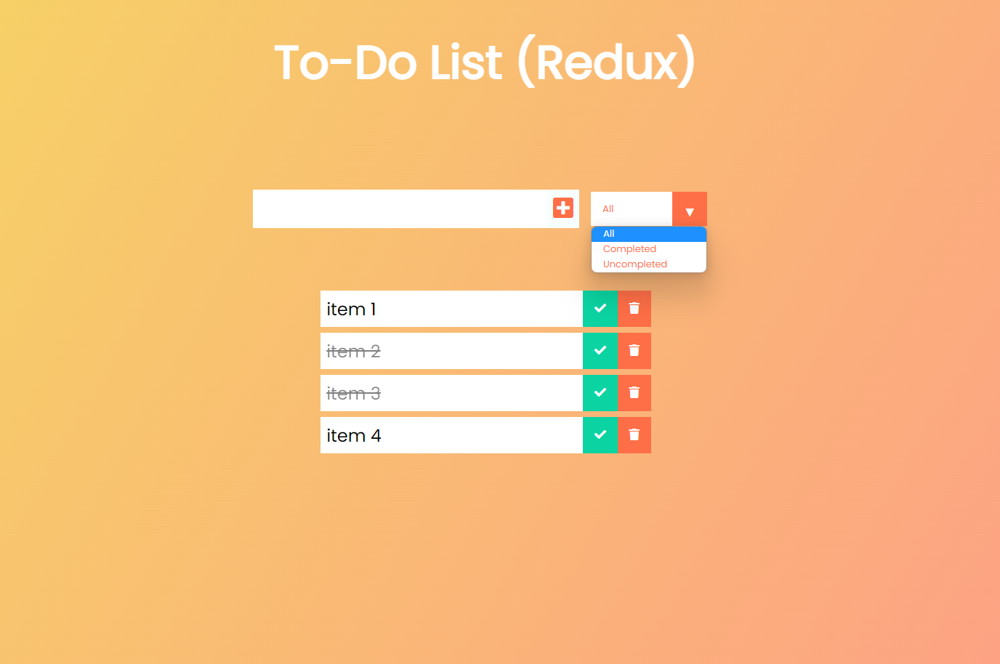

[![LinkedIn][linkedin-shield]][linkedin-url]

<!-- PROJECT LOGO -->
 

  

    a To-Do List is a React/Redux webb app - this repository contains its source code
     
    <a href="https://spatulatom.github.io/todo-reactjs-redux/"><strong>View the deployed app »</strong></a>
     
     
   
  

<!-- TABLE OF CONTENTS -->

  
Table of Contents

  <ol>
    <li><a href="#about-the-project">About The Project</a></li>
    <li><a href="#built-with">Built With</a></li>
    <li><a href="#acknowledgments">Acknowledgments</a></li>
  </ol>

<!-- ABOUT THE PROJECT -->
## About The Project

This little project is a to-do list built with React and Redux library. Tasks on the list can be marked as completed or they can be deleted and then the whole list can be sorted accordingly: it can display all tasks, only completed tasks or only uncompleted tasks. Tasks are being saved in localStorage.

(<a href="#readme-top">back to top</a>)

### Built With

* HTML, CSS
* [![React][React.js]][React-url]
* Redux
* GitHub pages for deployment
* Chrome Developer Tools for testing screen sizes and using Lighthouse.
* Visual Studio Code as a local IDE & repository.

This React.js app is using Redux with Hooks like useSelector() and useDispatch() for connecting to the Redux store and
Redux Toolkit's createSlice function (that uses Immer library) for creating reducers (and writing immutable updates in the reducer - no more tedious state coping like in the older verion of Redux). Actions are dispatched to manage saving/retriving state from localStorage through the rerender cycles.

(<a href="#readme-top">back to top</a>)

## Acknowledgments

*  https://redux.js.org/

(<a href="#readme-top">back to top</a>)

<!-- MARKDOWN LINKS & IMAGES -->

[linkedin-shield]: https://img.shields.io/badge/-LinkedIn-black.svg?style=for-the-badge&logo=linkedin&colorB=555
[linkedin-url]: https://www.linkedin.com/in/tomasz-s-069249244/
[product-screenshot]: images/screenshot.png
[Next.js]: https://img.shields.io/badge/next.js-000000?style=for-the-badge&logo=nextdotjs&logoColor=white
[Next-url]: https://nextjs.org/
[React.js]: https://img.shields.io/badge/React-20232A?style=for-the-badge&logo=react&logoColor=61DAFB
[React-url]: https://reactjs.org/
[Vue.js]: https://img.shields.io/badge/Vue.js-35495E?style=for-the-badge&logo=vuedotjs&logoColor=4FC08D
[Vue-url]: https://vuejs.org/
[Angular.io]: https://img.shields.io/badge/Angular-DD0031?style=for-the-badge&logo=angular&logoColor=white
[Angular-url]: https://angular.io/
[Svelte.dev]: https://img.shields.io/badge/Svelte-4A4A55?style=for-the-badge&logo=svelte&logoColor=FF3E00
[Svelte-url]: https://svelte.dev/
[Laravel.com]: https://img.shields.io/badge/Laravel-FF2D20?style=for-the-badge&logo=laravel&logoColor=white
[Laravel-url]: https://laravel.com
[Bootstrap.com]: https://img.shields.io/badge/Bootstrap-563D7C?style=for-the-badge&logo=bootstrap&logoColor=white
[Bootstrap-url]: https://getbootstrap.com
[JQuery.com]: https://img.shields.io/badge/jQuery-0769AD?style=for-the-badge&logo=jquery&logoColor=white
[JQuery-url]: https://jquery.com 
